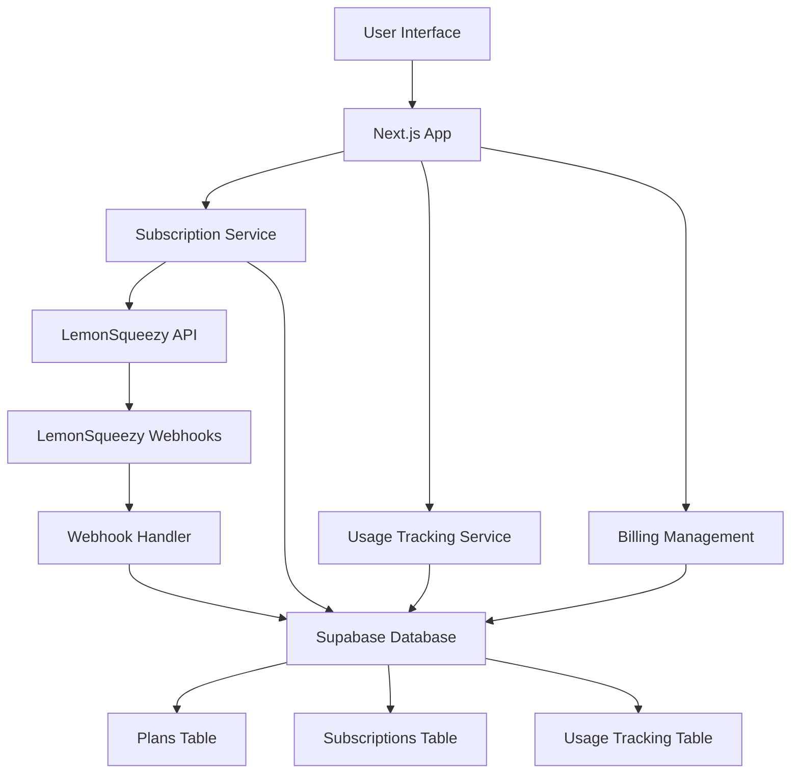

# Design Document

## Overview

The LemonSqueezy payment integration system provides a complete subscription management solution for MemoryAI. The system handles plan subscriptions, usage tracking, billing management, and payment processing through LemonSqueezy's API and webhook system. The design follows a modular approach with clear separation between payment processing, subscription management, and usage enforcement.

## Architecture

### High-Level Architecture



### Database Schema Design

The system extends the existing Supabase schema with new tables for subscription management:

1. **subscription_plans** - Stores plan definitions and limits
2. **user_subscriptions** - Tracks user subscription status
3. **usage_tracking** - Monitors user usage against plan limits
4. **webhook_events** - Logs webhook events for audit

### Component Architecture

- **Payment Components**: Subscription buttons, billing dashboard, plan comparison
- **Services**: Subscription management, usage tracking, webhook processing
- **API Routes**: LemonSqueezy integration, webhook handlers, subscription management
- **Middleware**: Usage limit enforcement, subscription status checks

## Components and Interfaces

### Core Components

#### 1. Subscription Management Service
```typescript
interface SubscriptionService {
  createCheckoutSession(userId: string, planId: string): Promise<CheckoutSession>
  updateSubscriptionStatus(subscriptionId: string, status: SubscriptionStatus): Promise<void>
  getCurrentSubscription(userId: string): Promise<UserSubscription | null>
  cancelSubscription(subscriptionId: string): Promise<void>
}
```

#### 2. Usage Tracking Service
```typescript
interface UsageTrackingService {
  checkUsageLimit(userId: string, resourceType: 'memory' | 'file'): Promise<boolean>
  incrementUsage(userId: string, resourceType: 'memory' | 'file'): Promise<void>
  getCurrentUsage(userId: string): Promise<UsageStats>
  resetUsage(userId: string): Promise<void>
}
```

#### 3. Billing Dashboard Component
```typescript
interface BillingDashboardProps {
  currentPlan: SubscriptionPlan
  usage: UsageStats
  subscription: UserSubscription
  onPlanChange: (planId: string) => void
  onCancelSubscription: () => void
}
```

#### 4. Plan Restriction Middleware
```typescript
interface PlanRestrictionMiddleware {
  enforceMemoryLimit(userId: string): Promise<boolean>
  enforceFileLimit(userId: string): Promise<boolean>
  getUpgradePrompt(userId: string, resourceType: string): Promise<UpgradePrompt>
}
```

### API Endpoints

#### Subscription Management
- `POST /api/subscriptions/checkout` - Create LemonSqueezy checkout session
- `GET /api/subscriptions/current` - Get user's current subscription
- `POST /api/subscriptions/cancel` - Cancel subscription
- `POST /api/subscriptions/change-plan` - Change subscription plan

#### Webhook Handling
- `POST /api/webhooks/lemonsqueezy` - Handle LemonSqueezy webhooks
- `GET /api/webhooks/verify` - Verify webhook signatures

#### Usage Tracking
- `GET /api/usage/current` - Get current usage stats
- `POST /api/usage/check` - Check if action is allowed under current plan

## Data Models

### Database Tables

#### subscription_plans
```sql
CREATE TABLE subscription_plans (
  id UUID PRIMARY KEY DEFAULT gen_random_uuid(),
  name VARCHAR(50) NOT NULL,
  slug VARCHAR(50) UNIQUE NOT NULL,
  price_monthly DECIMAL(10,2) NOT NULL,
  memory_limit INTEGER NOT NULL,
  file_limit INTEGER NOT NULL,
  lemonsqueezy_variant_id VARCHAR(255),
  is_active BOOLEAN DEFAULT true,
  created_at TIMESTAMP WITH TIME ZONE DEFAULT NOW(),
  updated_at TIMESTAMP WITH TIME ZONE DEFAULT NOW()
);
```

#### user_subscriptions
```sql
CREATE TABLE user_subscriptions (
  id UUID PRIMARY KEY DEFAULT gen_random_uuid(),
  user_id UUID NOT NULL REFERENCES auth.users(id) ON DELETE CASCADE,
  plan_id UUID NOT NULL REFERENCES subscription_plans(id),
  lemonsqueezy_subscription_id VARCHAR(255) UNIQUE,
  status VARCHAR(50) NOT NULL DEFAULT 'active',
  current_period_start TIMESTAMP WITH TIME ZONE,
  current_period_end TIMESTAMP WITH TIME ZONE,
  cancel_at_period_end BOOLEAN DEFAULT false,
  created_at TIMESTAMP WITH TIME ZONE DEFAULT NOW(),
  updated_at TIMESTAMP WITH TIME ZONE DEFAULT NOW()
);
```

#### usage_tracking
```sql
CREATE TABLE usage_tracking (
  id UUID PRIMARY KEY DEFAULT gen_random_uuid(),
  user_id UUID NOT NULL REFERENCES auth.users(id) ON DELETE CASCADE,
  memory_count INTEGER DEFAULT 0,
  file_count INTEGER DEFAULT 0,
  last_reset_at TIMESTAMP WITH TIME ZONE DEFAULT NOW(),
  created_at TIMESTAMP WITH TIME ZONE DEFAULT NOW(),
  updated_at TIMESTAMP WITH TIME ZONE DEFAULT NOW()
);
```

#### webhook_events
```sql
CREATE TABLE webhook_events (
  id UUID PRIMARY KEY DEFAULT gen_random_uuid(),
  event_type VARCHAR(100) NOT NULL,
  lemonsqueezy_event_id VARCHAR(255) UNIQUE,
  payload JSONB NOT NULL,
  processed BOOLEAN DEFAULT false,
  created_at TIMESTAMP WITH TIME ZONE DEFAULT NOW()
);
```

### TypeScript Interfaces

```typescript
interface SubscriptionPlan {
  id: string
  name: string
  slug: string
  priceMonthly: number
  memoryLimit: number
  fileLimit: number
  lemonsqueezyVariantId?: string
  isActive: boolean
}

interface UserSubscription {
  id: string
  userId: string
  planId: string
  lemonsqueezySubscriptionId?: string
  status: 'active' | 'cancelled' | 'expired' | 'past_due'
  currentPeriodStart?: Date
  currentPeriodEnd?: Date
  cancelAtPeriodEnd: boolean
}

interface UsageStats {
  memoryCount: number
  fileCount: number
  memoryLimit: number
  fileLimit: number
  lastResetAt: Date
}
```

## Error Handling

### Payment Errors
- **Checkout Failure**: Redirect to billing page with error message
- **Webhook Processing Failure**: Log error and retry mechanism
- **Subscription Status Sync Issues**: Fallback to LemonSqueezy API verification

### Usage Limit Errors
- **Memory Limit Exceeded**: Show upgrade prompt with current usage stats
- **File Limit Exceeded**: Block upload with upgrade options
- **Plan Downgrade Issues**: Graceful handling with usage warnings

### API Error Responses
```typescript
interface APIError {
  error: string
  message: string
  code: string
  details?: any
}
```

## Testing Strategy

### Unit Tests
- Subscription service methods
- Usage tracking calculations
- Webhook payload processing
- Plan restriction logic

### Integration Tests
- LemonSqueezy API integration
- Database operations
- Webhook event processing
- Usage limit enforcement

### End-to-End Tests
- Complete subscription flow
- Plan upgrade/downgrade scenarios
- Usage limit enforcement
- Billing dashboard functionality

### Test Data Setup
- Mock LemonSqueezy webhook payloads
- Test subscription plans
- Sample user usage data
- Error scenario simulations

## Security Considerations

### Webhook Security
- Verify LemonSqueezy webhook signatures
- Validate webhook payload structure
- Implement idempotency for webhook processing
- Rate limiting on webhook endpoints

### Subscription Security
- Validate user ownership of subscriptions
- Secure API endpoints with authentication
- Encrypt sensitive subscription data
- Audit trail for subscription changes

### Usage Tracking Security
- Prevent usage manipulation
- Secure usage increment operations
- Validate usage limits server-side
- Monitor for unusual usage patterns

## Performance Considerations

### Database Optimization
- Index on user_id for quick subscription lookups
- Efficient usage tracking queries
- Pagination for billing history
- Connection pooling for high traffic

### Caching Strategy
- Cache subscription plans (rarely change)
- Cache user subscription status
- Cache usage stats with TTL
- Redis for session-based caching

### API Performance
- Async webhook processing
- Batch usage updates
- Optimized database queries
- Response compression

## Migration Strategy

### Database Migrations
1. Create new subscription tables
2. Seed initial plan data
3. Create default free subscriptions for existing users
4. Set up usage tracking for existing users

### Deployment Strategy
1. Deploy database schema changes
2. Deploy API endpoints (inactive)
3. Deploy UI components (feature flagged)
4. Configure LemonSqueezy webhooks
5. Enable feature flags
6. Monitor and validate

### Rollback Plan
- Feature flags for quick disable
- Database migration rollback scripts
- LemonSqueezy webhook deactivation
- Fallback to existing pricing display